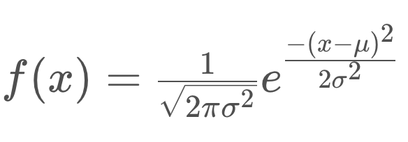
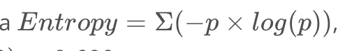

# Bayesian Thinking

## Overview
- Allows for uncertainty 
- Core of stats 
- Project Zero
- Basic + Conditional Probability 
- Bayes’ rule 
- Probability distributions 
- Localization
- Project 1 -> 2D histogram filter, implementing localization

## Probability: 
- Uncertainty in every part of the car 
- Learning Objectives:
  - Independent Events 
  - Data -> Stats -> Causes
  - Data <- Prob <- Causes 

## Conditional Probability:
- P (A | B) - probability of A GIVEN B
  - Sensor measurement of data to make better estimates 
  - = P(A, B) / P(B)
- P(A) - prob of A
- P(-A) - prob of NOT A
- P(A, B) - prob of A AND B
- P(A) = P(A|C) * P(C) + P(A|!C) * P(!C)
- NEXT: P(C|A)???

## Bayes' Rule 
- Given init prediction, we can improve that init prediction with more information 
  - GPS, more data: sensor data 
### Sensors: 3 Main Types
    - Camera (video)
    - Lidar (light based)
    - Radar (radio waves)
    - detect objects + scenery
    - Internal sensors: speed/direction of car, wheel orientation, internal temp

- Example: if wheels are turning to the right, located at curved section of road 
- **Bayes' Rule: mathematical way to correct measurements**
- Not only used to incorporate sensor data, also used for medical diagnosis
- "Holy Grail" of Probabilistic Inference 

### Example
- P(Cancer) = .01
- Test: 90% positive if you have C 
  - SENSITIVITY
- Test: 90% neg if don't have C
  - SPECITIVITY
- Question: P(C|P)?
- **Bayes' Rule: prior probability * test evidence = posterior probability**
- PRIOR = P(C) = .01
- ~~POSTERIOR~~ / **JOINT** =
  -  **P(C,P)** = P(C) * P(P|C) = .01 * .9 = **.009**
  - **P(!C,P)** = P(!C) * P(P|!C) = .99 * .1 = **.099**
- Normalize: 
  - STEP 1: Sum of 2 vals : .009 + .099 = **.108 = P(P)**
  - POSTERIOR
    - P(C|P) - .009 / P(P) (.108) = .0833333
  - Will work with negative as well!

Summary: 

## Probability Distributions 
- way in which self-driving car represents its internal beliefs about the world 
- **mathematical way to represent uncertainty across all possible outcomes**
- can be visualized using a graph esp in 2D cases 
- examples:
  -  tells most/least likely locations of cars 
  - rep. uncertainty in sensor measurements
### Types 
- discrete vs continous 
- 
#### Discrete Variables 
- can only take on certain values (usually countable var)
- ex: coin flips/dice roll
#### Continuous Varaibles
- ex: temp
- can take on decimal values 
- use some sort of instrument to measure them 
- can't associate counts with them 
### Discrete Probability Distribution 
- example: how many times a coin -> heads
- x-axis: outcomes (0-3 times heads)
- y-axis: probabili8ty 
- y-axis >= 0
- sum of all y-axis = 1
### Continous Probability Distributions 
- Probability over a continous range is almost zero (since there are so many values)
- Every outcome has probability 0
- Probabilities are over a range 
- P(a<x<=b) = |b-a|/range
#
- x-axis: unbroken line across range 
- y-axis: "probability density function"
  - doesn't rep. P directly
  - the area underneath the curve rep. P
#### Characteristics of a Continuous Distribution
- y values >= 0
- P(x) = 0
- P(a<x<=b) = area under the curve
- total area under curve = 1
#### Uniform Contineous Distribution 
- area forms a rectangle (base x height = prob)
  
## Gaussian Distribution 
- bell shaped curve :D
- continuous prob. distribution 
- Terms
  - **population** - entire set of data points 
  - **sample** - part of pop.
  - **mean** - avg 
  - **standard deviation** - measures spread in data 

### Guassian Equation 

- 3 vars: μ, σ, x
- μ = population mean 
- σ = std. deviation 

### Mean
- center of bell curve 
- everything else stays the same, curve is shifted 
  
### Standard Deviation
- increases as uncertainty increases
- curve gets wider and flatter

### Area Under the Curve 
- [Use a standard normal table](https://en.wikipedia.org/wiki/Standard_normal_table)

### Central Limit Theorem 
- if you take large enough samples from a pop. and calculate sample means, means will be normally distributed 
- holds as long as sample size is large enough and variable is **independent + random**

## Robot Localization
- NOTE: lesson assumes you have a good map. W/o it, techniques won't work well
  - SLAM (Simultaneous Localization +  Mapping): Doesn't req. good map
- robot lost in space and wants to see where it is
  - Satellite/GPS - not very accurate 
  - How can we know where we are w/ 2-10 cm of error?

### Total Probability
- Robot starts with a uniform belief function (each location has the same probability for where robot is) - **maxium confusion**
- Measurement of a door thats next to robot: Locations where a door is nearby has higher probability! (**Posterior**)
  - Robot takes measurement: take PRODUCT of probability
  - **ex.** if robot sees green, multiply P(green areas) with .6 and P(red areas) with .2, so green areas are **3X more likely**
    - PROBABILITY DOESNT = 1 NOW NEED **NORMALIZATION**
    - take the sum of the probabilities and divide the P(area)/sum
- Robot moves right -> belief function *shifts* 
  - Convolution
- Robot takes another measurement after movement -> can find location (Localized)

### Exact + Inexact Motion
- Exact:
  - Robot lives in cyclic grid world (end wraps to the front)
  - Shifts EXACTLY one grid to the right, probabilities shift too
- Inexact:
  - Different probabilities of moving 
  - .1 prob. of moving 1 grid to right, .8 of moving 2 to right, .1 of moving 3 grids to right
  - Uniform distribution: after movement, distribution is the same!! 
    - Convolution?

### Limit Distribution
- With inexact motion, if a robot continues to move forever, without taking measurements
- Probability Distribution: **[1,0,0,0,0] -> [.2,.2,.2,.2,.2]**

### Sense and Move 
- Entropy: amount of uncertainty in a system 
  - SENSE measurement: decrease uncertainty/entropy
    - gains information
  - MOVE movement: increase uncertainty/entropy
    - loses information
  - 
  - more entropy, more noise 
