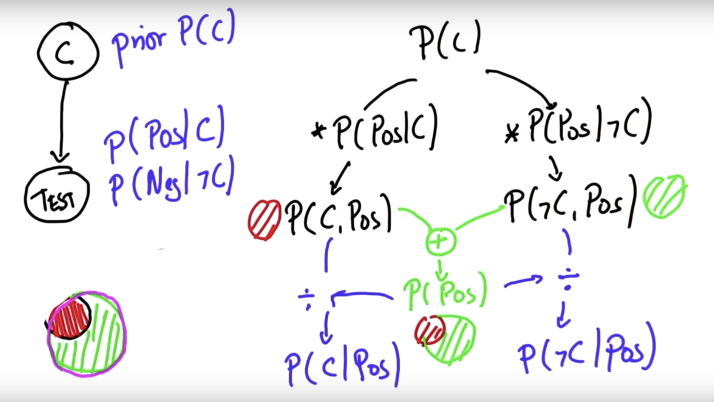

# Bayesian Thinking

## Overview
- Allows for uncertainty 
- Core of stats 
- Project Zero
- Basic + Conditional Probability 
- Bayes’ rule 
- Probability distributions 
- Localization
- Project 1 -> 2D histogram filter, implementing localization

## Probability: 
- Uncertainty in every part of the car 
- Learning Objectives:
  - Independent Events 
  - Data -> Stats -> Causes
  - Data <- Prob <- Causes 

## Conditional Probability:
- P (A | B) - probability of A GIVEN B
  - Sensor measurement of data to make better estimates 
  - = P(A, B) / P(B)
- P(A) - prob of A
- P(-A) - prob of NOT A
- P(A, B) - prob of A AND B
- P(A) = P(A|C) * P(C) + P(A|!C) * P(!C)
- NEXT: P(C|A)???

## Bayes' Rule 
- Given init prediction, we can improve that init prediction with more information 
  - GPS, more data: sensor data 
### Sensors: 3 Main Types
    - Camera (video)
    - Lidar (light based)
    - Radar (radio waves)
    - detect objects + scenery
    - Internal sensors: speed/direction of car, wheel orientation, internal temp

- Example: if wheels are turning to the right, located at curved section of road 
- **Bayes' Rule: mathematical way to correct measurements**
- Not only used to incorporate sensor data, also used for medical diagnosis
- "Holy Grail" of Probabilistic Inference 

### Example
- P(Cancer) = .01
- Test: 90% positive if you have C 
  - SENSITIVITY
- Test: 90% neg if don't have C
  - SPECITIVITY
- Question: P(C|P)?
- **Bayes' Rule: prior probability * test evidence = posterior probability**
- PRIOR = P(C) = .01
- ~~POSTERIOR~~ / **JOINT** =
  -  **P(C,P)** = P(C) * P(P|C) = .01 * .9 = **.009**
  - **P(!C,P)** = P(!C) * P(P|!C) = .99 * .1 = **.099**
- Normalize: 
  - STEP 1: Sum of 2 vals : .009 + .099 = **.108 = P(P)**
  - POSTERIOR
    - P(C|P) - .009 / P(P) (.108) = .0833333
  - Will work with negative as well!

Summary: 
