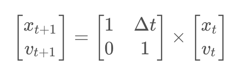
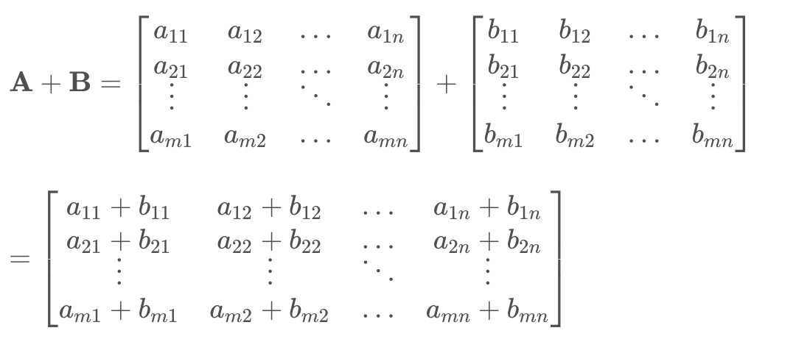
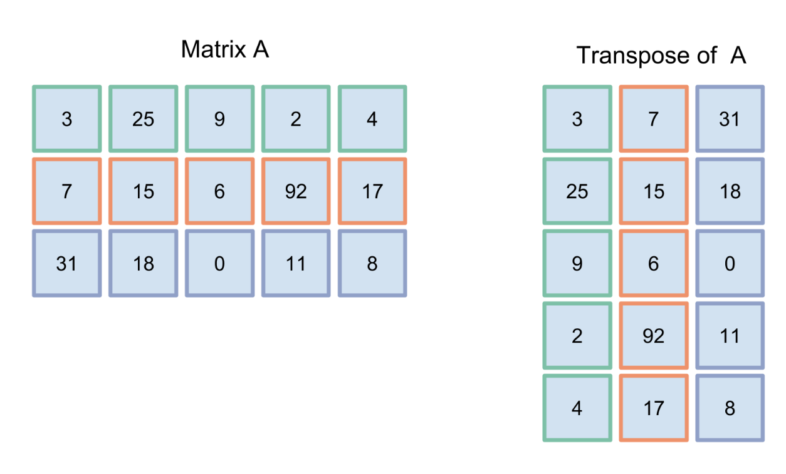
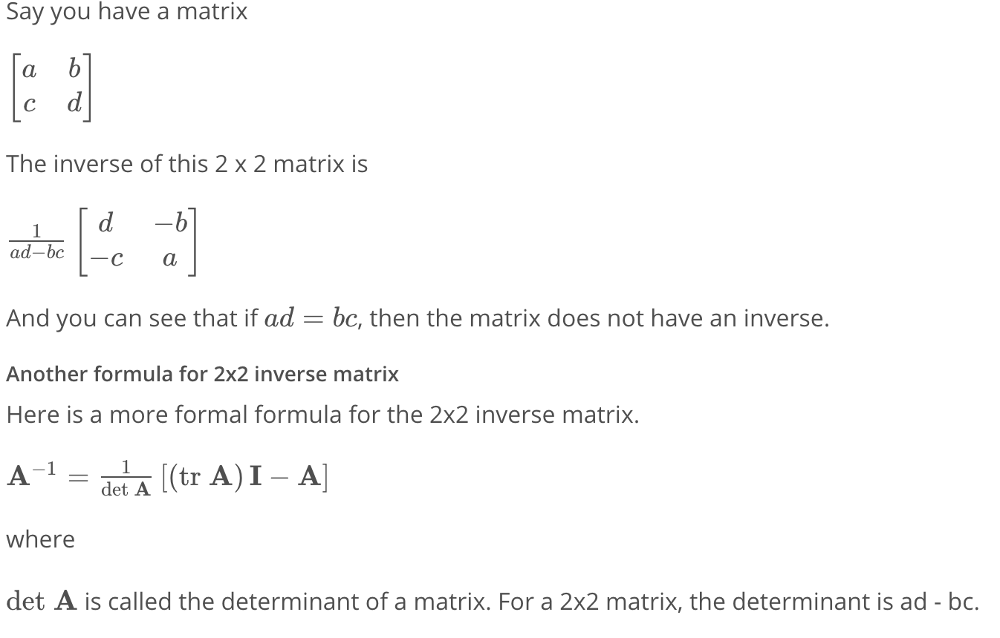

# Working with Matrices

## Introduction to Kalman Filters 
- car uses lasers and radars to track other cars/obstacles 
- take sensor data to not only localize, but also to avoid collisions 
- **TRACKING: technique - Kalman Filter**
  - Continuous + Uni-Modal vs Monte Carlo Localization (Discrete + Multi-Modal)
  - Apply to both localization + tracking
### Gaussians 
- parameterized by mean (mu) + variance (sigma^2)
- used for Kalman Filter to provide best estimate 
- Single peak - UNI MODAL 
- wider spread -> more variance 
- want less variance, MORE CERTAIN/narrower
### Kalman Filters
- Measurement + Movement: can apply same rules 
- Measurement: multiply the 2 gaussians (prior belief + measurement)
  - mean shifts to something in between
  - peak of gaussian is HIGHER (higher certainty)
- Calculating Measurement Step: see code
  - Multiplication of gaussians 
- Calculating Motion Step: see code 
  - easy addition :)

## Object Oriented Programming 
### Overloading 
- any func with underscores (ex. ```__init__, __add__```)
  - called automatically based on KEYWORDS

### Matrix Multiplication 
- TODO

## Matrices 
- 2D / MultiD Kalman Filters 
  - req. matrix multiplication 
  - x' = x + ẋ (Complete  x' = x + Δtẋ)
    - x position **after** motion is = to x pos **before** *plus* **velocity** in the x direction 
  - States of Filters 
    - Observables (like location)
    - Hidden (like velocity)
    - Can use observables to find hidden states
$x\y$
### The Kalman Filter Equations + Matrix Math
- Being able to translate equations online -> code 
- Kalman Filter Equations (Predictions): 
  - x' = Fx + Bu **OR $\hat{x}_{k|k-1} = F_k \hat{x}_{k-1|k-1}$**
  - P' = FPF(t) + Q  **OR $P_{k|k-1} = F_kP_{k-1|k-1}F_k^T + Q_k$**
- Measurement:
  - y - z - Hx' 
  - S = R + HP'H(t) **OR $S_k = H_kP_{k|k-1}H_k^T + R_k$** (kalman gain)
  - K = P'H(t)S(-1) **OR $K_k = P_{k|k-1}H_k^TS_k^{-1}$** (kalman gain)
  - x = x' + Ky **OR $\hat{x}_{k|k} = \hat{x}_{k|k-1} + K_k\tilde{y}_k$**
  - P = (I - KH) P' **OR $P_{k|k} = (I - K_kH_k)P_{k|k-1}$**
  - y = z - Hx **OR $\tilde{y}_k = z_k - H_k\hat{x}_{k|k-1}$**
#### Variable Definitions
- $\hat{x}$ - state vector
- **$F$** - state transition matrix
- **$P$** - error covariance matrix
- **$Q$** - process noise covariance matrix
- **$R$** - measurement noise covariance matrix
- **$S$** - intermediate matrix for calculating Kalman gain
- **$H$** - observation matrix
- **$K$$** - Kalman gain
- $\tilde{y}$ - difference between predicted state and measured state
- **$z$** - measurement vector (lidar data or radar data, etc.)
- **$I$** - Identity matrix
#### Notation 
- lowercase: vectors
  - bold, unbolded is a scalar  
- upper: matrices 
  - bold
- Addition 
- Multiplication
- Identity Matrix 
- Transpose 
- Inverse 
### Representing State W/ Matrices 
- The State Vector 
  - 1d: [distance, velocity]
  - 2d: [distancex, distancey, velocityx, velocityy]
- State Vector in 1D World 
  - distance = velocity * Δtime + old_dist
  - velocity = velocity 
- Updating State W/ Matrix Algebra 
- 
- notation: x' = Fx + Bu

### Matrix Addition 
- 
- Characteristics 
  - sizes of matrices need to be the same 
  - same rules apply to **subtraction**

### Matrix Multiplication 
- num of columns of A **equal** to num of rows in B 
  - m x n **and** n x p
- $(\bold{AB})_{ij} = \sum_{k=1}^n a_{ik}b_{kj}$
  - take row i of A, column j of B, **APPLY DOT PRODUCT**

### Transpose of a Matrix 
- notation: $\bold{A^T}$
- turn a 3x5 matrix to 5x3 
  - first row becomes first column, first column becomes first row 
  -  
-  Formal Math Def: $[\bold{A^T}]_{ij} = [\bold{A}]_{ji}$

### The Identity Matrix 
- n x n matrix with 1 across main diagonal and 0 for all other elements 
- like the number 1 
- $\bold{AI = IA = A}$

### Matrix Inverse 
- notation: $\bold{A^{-1}}$
- Formal:  $\bold{A \times A^{-1} = A^{-1} \times A = I}$
  - only square matrices have inverses, but not all 
- Inverse of 1x1 Matrix: 1/x 
- Inverse of 2x2 Matrix: 
  - 
  - tr A = trace of a matrix -> sum across major diagonal
- 