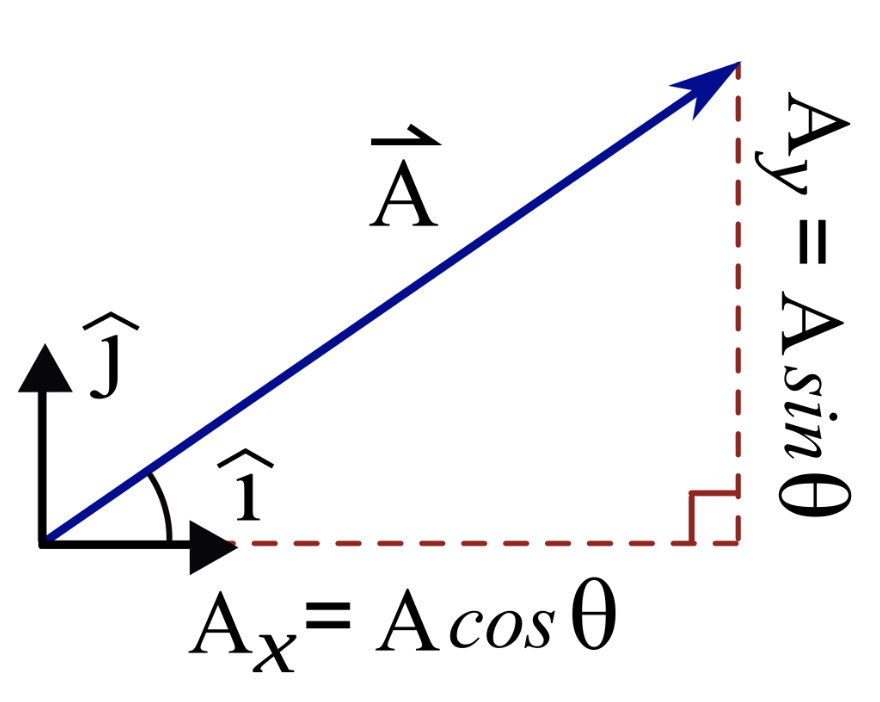

# Vechicle Motion + Control

## Odometers, Speedometers, and Derivatives
- Odometry: robot's ability to integrate internal measurements to detrmine location 
- Uses calc: derivatives + integrals 
- Take car's odometry data (dist travels) -> infer new velocity + acceleration
- 
- $v_{avg}$ = $\Delta x / \Delta t$  = slope of line of pos vs time graph
### Avg vs Instantaneous Speed
- Instanteous Speed - Speedometer
1. Velocity - instantaneous rate of change of position 
2. Velocity - slope of tangent line of position (DERIVATIVE)
3. Velocity = DERIVATIVE of position 

### Differential Notation 
0. What Newton and Liebniz share (d/dt)
   - $df \over dt$ means to take the derivative. It means "Take the derivative **with respect to** t of whatever function shows up to the right."
1. Liebniz Notation (prime)
   - $dx \over {dy} = f\prime(x)$
2. Newton's Notation (dot)
   - As a result, he was usually thinking of derivatives with respect to time (not some abstract x variable).

### How Odometers Work
- couple rotation of vehicle wheels to rotation of gauge displayed on dial 
- typically 750 rotations in 1 mile 
- $\delta \theta_{odometer} \over \delta \theta_{tires}$ = $1 \over 7,500$
- 

## Accelerometers, Rate Gyros, + Integrals
- sensors measure acceleration in 3 directions as rotations rates around 3 axes (pitch, roll, yaw)
- learn how integral to accumulate changes in data + motion
- Getting integral of acceleration to find velocity + position 
### Rate Gyros
- measure angular velocity 
- measures yaw rate of vehicle 

## 2D Robot Motion + Trig
- 
- use vehicle's heading + displacement to calculate vertical + horizontal changes in motion 
